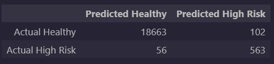
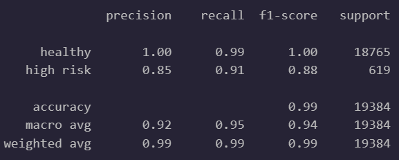
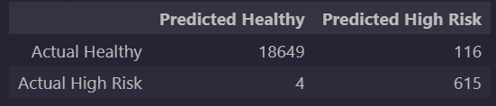

# Credit Risk Classification Model - Testing and Analysis

## Overview of the Analysis

### Purpose

Using Python to build a Supervised Machine Learing model that can predict the creditworthiness of borrowers based on the given information listed below with a high degree of accuracy.

### Our Dataset

Historical lending activity from a peer-to-peer lending services company including the following attributes:  

* `Loan Size`
* `Interest Rate`
* `Borrower Income`
* `Debt to Income`
* `Number of Accounts`
* `Derogatory Marks`
* `Total Debt`

### Process

From this labeled dataset, we attempted to train a model to predict if the loans were marked as "High Risk" or "Healthy" using `Logistic Regression Analysis` for classification.  To accomplish this goal we [trained two models](Credit_Risk/credit_risk_classification.ipynb) according to the following process:  

1. Separating the labels from the loan data so the model couldn't "see" what it was trying to predict.
2. Splitting the data into training  and testing segments so the model would have data it hadn't seen before to test if our training had worked.
3. Running the training on the first model with the data as-is and checking it on the test results.
4. Resampling the data using a method called `Random Over-Sampling` where we create extra samples of the minority group (the high risk group in this case) so that the samples of each group were equal in size, and we could be sure our model could "see" both groups an equal number of times.  Our original dataset split was **75,036 Healthy** vs **2,500 High Risk**, which could cause our model to overlook the smaller group.  Our resampled data was **56,271 samples each** for both Healthy and High Risk.
5. Training the second model on the newly resampled dataset, and checking the second model on the original test data to compare the results to the original model.

## Results

### Term Descriptions

**Precision:** Number of correct positive predictions over all predicted positives (postivies = high risk loans in this case).  In simple terms, the ability of our models to avoid false positives.

**Recall:** Number of correct positive predictions over all actual positives (positives again are equal to high risk loans in this case).  In simple terms, the ability of our models to catch all cases of positives and avoid false negatives.

**Balanced Accuracy:** Weighted average of accuracy per each class or sub-group (healthy loans vs high risk loans in our case).  In simple terms, a general measure of how often our models are correct, taking into account each group they are predicting.

### Machine Learning Model 1

* **Description of Model:** Logistic Regression Analysis of Original Data
* **Balanced Accuracy Score:** 95.2%
* **Precision Scores:**
  * Healthy Loans: 100%
  * High Risk Loans: 85%
* **Recall Scores:**
  * Healthy Loans: 99%
  * High Risk Loans: 91%

**Confusion Matrix:**  
  

**Classification Report:**  

### Machine Learning Model 2

* **Description of Model:** Logistic Regression Analysis of Randomly Oversampled Data
* **Balanced Accuracy Score:** 99.4%
* **Precision Scores:**
  * Healthy Loans: 100%
  * High Risk Loans: 84%
* **Recall Scores:**
  * Healthy Loans: 99%
  * High Risk Loans: 99%

**Confusion Matrix:**  
  

**Classification Report:**  

## Summary

Both models performed extremely well in predicting Healthy loans with 100% Precision and 99% Recall, but our first model scored a bit lower with High Risk loans.  With a Precision score of 85% it returned 102 false positives in our tests.  It also returned 56 false negatives with a Recall score of 91%.

The resampled data seemed to make a noticable impact in improving performance, particularly on Recall, which jumped from 91% up to 99% and brought our overall Balanced Accuracy Score up from 95.2% to 99.4%.  The false negatives dropped considerably, from 56 to only 4, however there was a slight increase in false positives, from 102 to 116, accounting for the decrease in Precision for this model, dropping from 85% to 84%.  This was the only metric where our second model was outperformed by the first.

These changes make sense, given the tendency for Random Oversampling to over-represent the minority group by nature of how it works, but given the final results there does seem to be an improvement in performance which looks very promising.

The performance of this model in the real world will depend greatly on the context in which it is used (i.e. if it is more important for it to predict the High Risk loans or the Healthy ones).  I would recommend discussing these results with an industry Subject Matter Expert to determine its use-case and the implications for trading a decrease in false negatives for an increase in false positives to determine a final decision on whether to implement this model, but the strong Accuracy and Recall scores indicate that this model is likely to perform well in the real world based on the data we've collected so far.
